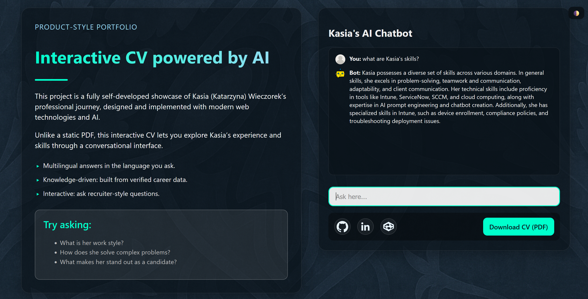

# Quiviva – An Interactive AI CV

[](https://vercel.com/) 
 
 
 
 


---

## 💡 What it is  

A **standalone AI Chatbot** that powers [kasiaaichatbot.me](https://www.kasiaaichatbot.me).  
It transforms a professional profile into an **interactive, multilingual experience** — not just a PDF, but a living CV where you can ask questions and get structured, recruiter-style answers.  

Built with **vanilla JavaScript**, **Node.js serverless functions on Vercel**, and a structured **JSON profile**.  

---

## 🌱    Project Story

This project was born from pure passion, relentless curiosity, and an unstoppable urge to create.
After years in IT, I decided to step into the world I had always admired in my developer colleagues.
Technology has always been my fire — a spark that ignites excitement every time I dive deeper.
It’s an endless well, where every day uncovers something new.

At the same time, I want to be transparent: I am new both to programming and to GitHub.
I am learning step by step, often using AI as a guide to help me explore this vast field.
If you notice any gaps in formatting, structure, or repository practices, they are not intentional flaws,
but rather signs of a beginner taking her first steps in a new environment.
I trust that with time, I will master these tools and workflows more fluently,
just as I have done with every challenge in my IT career.

---

## 💡 Why I Built It

Building this chatbot wasn’t just about code — it was about breaking into a new frontier,  
learning programming hands-on, and blending creativity with logic.  
I wanted to turn a job search into an adventure, a joyful exploration of how AI and human stories can come together.  
Instead of sending another static PDF into the void, I created an interactive experience that speaks, learns, and inspires.  

---

## 🚀 What Coding Means to Me

For me, coding is not just skill — it’s a mindset, a playground, and a stage for collaboration.  
What excites me most is not just the technology itself, but how it connects people:  
**networking, teamwork, and creating something bigger together.**  

---

## 🤝 Call for Collaboration

That’s why I’m openly inviting cooperation and collaboration.  
If you share the same spark for technology, creativity, or pushing boundaries, let’s build something together.  
This project is proof of what happens when curiosity meets code —  
and I’m ready to take it further with others who feel the same fire.
Have ideas or spot a bug? Open an Issue or propose a PR. First-timers welcome 😊

---

## ✨ Looking Ahead

This chatbot is my bold step into programming — a joyful rebellion against stereotypes,  
proof that even a career search can be reimagined through curiosity and creativity.  
Whether or not it wins **For the Love of Code 2025**, it has already been a win for me:  
a source of growth, fun, and endless ideas waiting to be turned into reality.  

This is only the beginning — my head is still buzzing with concepts, brainstorms, and visions ready to take shape. 🚀  


## ✨ Demo  

- Live: [https://www.kasiaaichatbot.me](https://www.kasiaaichatbot.me)  
- Screenshot:  

    

---

## 🚀 Features  

- 🌍 **Multilingual answers** – detects input in your language.  
- 📑 **Profile-driven** – grounded in `kasia-profile.json` data.  
- 🧑‍💼 **Recruiter-friendly tone** – concise, professional, structured.  
- 🔒 **Secure serverless backend** – API key hidden safely on the server.  
- 🪄 **Easter Egg mode** – mention “Gandalf” or “Thor” and you’ll unlock nerdy rhyming answers.  

---

## 🧩 Project Structure  

```
Ai_ChatBot/
├── api/                  # Serverless backend (Vercel/Node.js)
│   ├── chat.js           # Chatbot handler (OpenAI API + profile logic)
│   └── visits.js         # Visit counter endpoint with rate limiting
│
├── data/
│   ├── kasia-profile.json # Professional profile in JSON
│   └── counter.json       # Visit counter (auto-updated)
│
├── public/
│   ├── index.html         # Landing page with chatbot UI
│   ├── style/main.css     # Styling (dark theme, responsive)
│   ├── js/chat-ui.js      # Chat UI logic (fetch + display messages)
│   ├── assets/
│   │   ├── cv/CV_EN_Katarzyna_Wieczorek.pdf # Traditional CV download
│   │   └── img/           # Backgrounds, icons, graphics
│   └── chat.ico
│
├── vercel.json
├── package.json
├── package-lock.json
├── README.md
└── .gitignore
```

---

## 🔐 Environment Variables  

Set in **Vercel → Project Settings → Environment Variables**:  

- `OPENAI_API_KEY` – your OpenAI key (server-side only).  
- `ALLOWED_ORIGIN` – CORS allowlist (e.g. `https://kasiaaichatbot.me`).  

> 🔑 Never commit `.env*` files. Secrets stay in Vercel.  

---

## 🛠️ Run Locally  

```bash
git clone https://github.com/katawiecz/quiviva.git
cd quiviva
npm install

# Add local .env
echo "OPENAI_API_KEY=sk-..." > .env
echo "ALLOWED_ORIGIN=http://localhost:3000" >> .env

# Run with Vercel
vercel dev
```

---

## 🧪 How to Test  

Open on localhost or in your Vercel preview.  
Ask questions in English, Polish, Italian or other language. 
Expect concise, recruiter-friendly answers.  
Drop in fantasy words like “Gandalf” or “Thor” to see the Easter Egg mode in action.  

---

## 📦 Tech Highlights  

- **HTTP & CORS** – safe request/response handling  
- **JSON** – structured profile data & parsing  
- **Node.js** – serverless backend functions  
- **Fetch** – error handling with fallbacks  
- **File System** – JSON served as static asset  

---

## 📄 License  

- Code: **MIT License** – free to use, modify, and share with attribution.  
- Content (profile data, graphics, CV PDF): **CC BY-NC 4.0** – non-commercial reuse with attribution.  

---

## 🎯 For the Love of Code 2025  

This project is proudly submitted to **#ForTheLoveOfCode**.  
It represents not just code, but joy, curiosity, and the belief that technology should be playful and human.  
Deadline: September 22, 2025 AoE.  

---

# License 🎉

This repository uses a **dual-license** approach 🚀:

## 1. Code (Open Source – MIT) 💻
All **source code** in this repository is licensed under the **MIT License**, one of the most widely recognized open source licenses.  
✅ This makes the project fully eligible for participation in the **GitHub ForTheLoveOfCode 2025** contest!  

You are free to **use, modify, and share** the code, provided attribution is given to the original author (Katarzyna Wieczorek).  
👉 Full text: [MIT License](https://opensource.org/licenses/MIT)

## 2. Content (Non-Code Assets – CC BY-NC 4.0) 🎨
The **profile data, CV PDF, images, and other non-code assets** in this repository are licensed under  
the **Creative Commons Attribution-NonCommercial 4.0 International (CC BY-NC 4.0)** license.  

📌 You may **share and adapt** these materials for **non-commercial purposes** with attribution.  
❌ Commercial use is not permitted without explicit permission.  
👉 Full text: [CC BY-NC 4.0](https://creativecommons.org/licenses/by-nc/4.0/)

---

© 2025 Katarzyna Wieczorek ✨


### Cheers, and happy coding! ✨  
